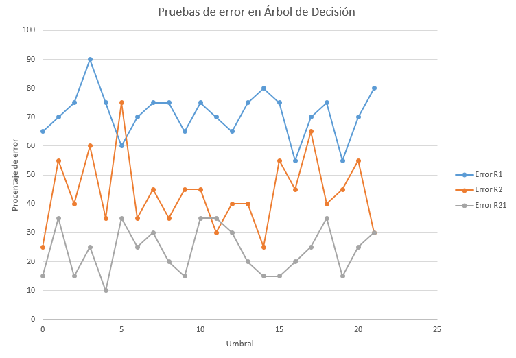
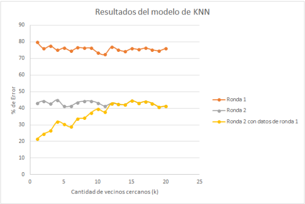
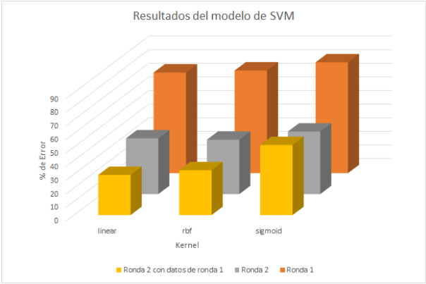
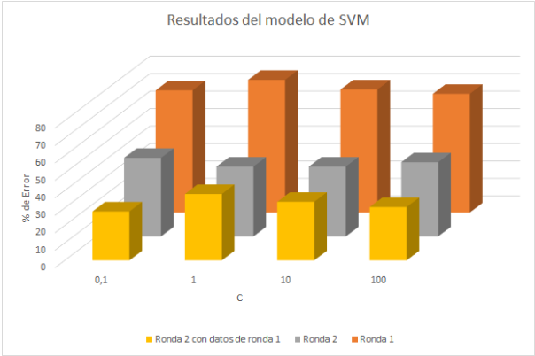
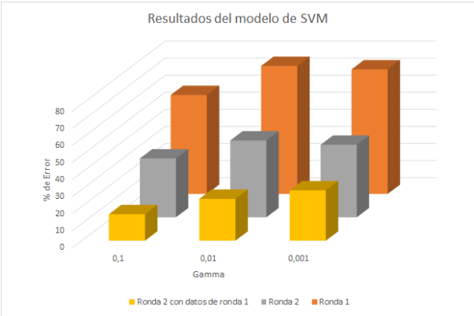

<h1>Predicción Votantes</h1>
<h2>IC-6200 Inteligencia Artificial</h2>
<h2>Integrantes</h2>
<ul>
<li>Brayan Fajardo Alvarado - 201157035</li>
<li>David Gómez Vargas - 2015028430</li>
<li>Luis Edward Rodríguez Varela - 2014082498</li>
</ul>

<h3>I Semestre 2018</h3>
<h1></h1>

---
<h2>1. Introducción</h2>

La predicción de resultados es uno de los más grandes retos que posee la inteligencia artificial, ya que se requiere tener un modelo, de aprendizaje de datos, que logre identificar atributos como entradas y realizar un análisis, específico de cada modelo, para predecir una salida, la cual se espera sea correcta basada en los datos de entrenamiento.

En este proyecto se desarrollan 5 modelos de aprendizaje, los cuales son:
<ul>
<li>Regresión logística.</li>
<li>Redes neuronales</li>
<li>Árboles de decisión</li>
<li>KNN</li>
<li>SVM</li>
</ul>

El objetivo de los modelos es que logren predecir las votaciones de la primera y segunda ronda en Costa Rica, los datos de entrenamiento fueron tomados de los datos de los votos hacia cada partido por mesa electoral, así es posible obtener los datos de las votaciones en cada distrito, cantón y provincia en la primera y segunda ronda. Es interesante poder realizar un análisis con respecto a los resultados en cada cantón o provincia y con los indicadores del Censo del 2011 poder concluir qué tipo de personas votaron por cada partido.

Con todos estos datos se puede crear una población que representa a todos los votantes Costarricenses con cada uno de los indicadores de su zona de votación, aunque ciertas personas votan en lugares diferentes de donde residen se puede hacer un análisis descriptivo que represente a la mayoría de las personas y tenga un impacto similar a los datos reales. En el presente informe se detalla el diseño de la solución para la generación de muestras que representan conjuntos de datos que son utilizados para aplicar algoritmos de inteligencia artificial creando modelos de aprendizaje paramétricos y no paramétricos.

<h2>2. Simulador de Votantes</h2>

Para realizar los modelos de predicción de votantes es necesario un generador de datos sobre las votaciones. En este mismo curso, en el primer proyecto corto se realizó un simulador de votantes con datos de la primera ronda, además, de datos sociales recopilados en el censo del 2011.

El diseño de este simulador de votantes se divide en 3 partes:

<ul>
 <li> Generación de la población: Se hace una carga de un archivo csv, el cual contiene la información de los votos obtenidos por partido por cantón, y a partir de este se generan los datos de toda la población del país. A este archivo se le agregaron todos los indicadores provenientes del censo realizado en Costa Rica en el 2011.</li>
 <li>Generación de la muestra país: A partir de la creación de la población, se realiza una selección de una determinada muestra indicada por el usuario, con una cantidad no mayor a 2 millones de personas. Para la selección de esta muestra se hace uso de un algoritmo de generación aleatoria, la cual toma en cuenta la proporción de personas que se pueden representar a nivel nacional, y con esto se permite obtener muestras más cercanas a la realidad.
Para la generación de la muestra país, se hace uso de la función: <strong>generar_muestra_pais(n)</strong>.</li>
<li>Generación de la muestra provincia: Para la generación de la muestra de una provincia, se realiza lo mismo realizado en la generación de la muestra de un país, con la única diferencia de que los datos son filtrados por la provincia dada por argumento desde la entrada de una función. Para la generación de una muestra de provincia, se utiliza la función <strong>generar_muestra_provincia(n, nombre_provincia)</strong>.</li>
</ul>

La salida de las funciones es una lista conteniendo las listas con los siguientes atributos:

<ul>
<li>Provincia donde voto.</li>
<li>Cantón donde voto.</li>
<li>Poblacion del canton.</li>
<li>Superficie del cantón.</li>
<li>Densidad del cantón.</li>
<li>Tipo de localidad (Urbano,
Rural).</li>
<li>Sexo.</li>
<li>Edad.</li>
<li>Viviendas individuales
ocupadas.</li>
<li>Promedio de ocupantes por
vivienda.</li>
<li>Estado de la vivienda
(Bueno, Malo).</li>
<li>Viviendas de vivienda con
respecto a los habitantes (Hacinamiento).</li>
<li>Alfabetismo.</li>
<li>Escolaridad promedio.</li>
<li>Asistencia a la educacion
regular.</li>
<li>Tasa de participacion (En
fuerza de trabajo).</li>
<li>Seguro laboral (Trabaja con
o sin seguro).</li>
<li>Persona nacional o
extranjera.</li>
<li>Persona discapacitada.</li>
<li>Persona asegurada.</li>
<li>Hogar con jefatura femenina.</li>
<li>Hogar con jefatura
compartida.</li>
<li>Partido por el cual el individuo voto en primera ronda.</li>
<li>Partido por el cual el individuo voto en segunda ronda.</li>
</ul>
<h2>3. Modelo Lineal</h2>

El modelo de regresión logística utiliza la biblioteca Tensorflow de inteligencia artificial para clasificar los datos, se crea una función lineal:

<blockquote>

<strong>y</strong> = m <strong>x</strong> + b

</blockquote>

Con esta función y los datos de entrenamiento se pueden encontrar los valores de "m" y "b" óptimos para predecir valores de salida.

<h3>Diseño del modelo</h3>

Para este modelo fue necesario convertir todos los datos de entrada a datos númericos, además, es necesario separar las entradas de las salidas de los datos de ejemplo para entrenar el modelo. Se utiliza oneHotEncoder de la biblioteca Scikit para convertir todos los datos a binario y así poder introducir los datos para entrenamiento

Esta biblioteca utiliza tensores, por lo que es necesario crear los marcadores iniciales "x" y "y", las variables "m" y "b" y la función lineal anterior, luego con descenso de gradiente y valores de regularización L1 y L2 se optimiza el modelo conforme es entrenado con los datos de entrenamiento. Los valores de regularización son usados para evitar el sobreajuste y eliminar el ruido en el modelo

<h3>Prueba del modelo</h3>

Para probar el modelo solo se necesita llamar la función eval(), brindando como parámetro el dato a probar y la sesión donde se optimizó la función con los tensores.

<h4>Análisis de resultados con diferentes valores de L1 y L2.</h4>

Para la regresión logística se analiza los valores L1 y L2 de regularización para evitar el sobreajuste, en la figura anterior se observan diferentes valores de error para cada una de las predicciones de las votaciones con diferentes parámetros de regularización. En el caso de la segunda ronda con conocimiento del voto de la primera ronda se observa que se obtiene un menor error con valores de regularización muy bajos, menores a 1. El procentaje de error mínimo es de aproximadamente 15% lo cual es bastante bueno para un modelo no paramétrico.

Para la predicción de la primera ronda y la segunda, sin el dato de la primera, se observa que los parámetros no tienen una tendencia muy clara, pero con valores muy altos de L1 y L2 no se visualiza un buen rendimiento.

---------------------------------------------------------------------------------------------------------------------
<h2>4. Red Neuronal</h2>

El modelo de Red neuronal utiliza la biblioteca de Keras la cual, está integrada, con un backend Tensorflow de inteligencia artificial. Las redes de neuronas artificiales (denominadas habitualmente como RNA o en inglés como: “ANN”) son un paradigma de aprendizaje y procesamiento automático inspirado en la forma en que funciona el sistema nervioso de los animales. Se trata de un sistema de interconexión de neuronas que colaboran entre sí para producir un estímulo de salida. En inteligencia artificial es frecuente referirse a ellas como redes de neuronas o redes neuronales. Forman parte de los denominados “Sistemas Inteligentes“, dentro de la rama de la Inteligencia Artificial.

<h3> Diseño del modelo </h3>

Para la realización del modelo fue necesario convertir todos los atributos a numeros para utilizar la red neuronal. Posteriormente los datos son convertidos a un arreglo numpy, el cual es la estructra, que se debe utilizar con Keras. Para realizar cada una de las 3 predicciones. Para cada prediccion el conjunto de entrenamiento es divido entre parte X que son los datos que recibe la red, y el conjunto de Y, que son la diferentes salidas que se posee. A continuacion se detallará cada predicción 

<ol>
<li> <strong> Predicción R2-R1 </strong>: predicción del partido político por el que se votó en primera ronda.
<li> <strong> Predicción R2 </strong>: predicción del partido político por el que se votó en segunda ronda. No
incluye la columna de voto real en primera ronda
</ol>
<ol>Los parametros que pueden configurarse en el modelo de red funcional son los siguientes: 
<li> <strong> Número de capas</strong>: Se refiere a la cantidad de capas ocultas que tendrá la neurona, estas capas se agregarán entre la capa inicial y la final.
<li> <strong> Número de unidades o neuronas </strong>: Se refiere a la cantidad de neuronas que tendra cada una de las capas ocultas creadas. Para efecto de pruebas puede utilizar los valores de 23 neuronas en 6 capas.
<li> <strong> Función de activación </strong>: Función de activación de la neurona. Los parámetros aceptados para esta función son 'relu' y
<li> <strong> Minimizar la perdida </strong>: Para minimizar la perdida se hace uso del algoritmo "Descenso de gradiente", el  cual provee la libreria Keras.
</ol>

<h3> Prueba del modelo </h3>

 Para saber cómo utilizr la predicción por red neuronal por favor véase el  manual de usuario 

Para el siguiente caso de prueba, se realizarán las predicciones R2_R1 y R2 con 23 neuronas en 6 capas.

--------------------------------------------------------------------------------------------------------------------
<h2>5. Árbol de decisión</h2>

 El aŕbol de decisión es un tipo de algoritmo el cual es utilizado para determinar la predicción de una muestra o arreglo de datos que posea varios atributos. Dicha predicción se realiza de inmediata, con lo cual se van comparando los valores que posee una expresión lógica y se compara con los atributos originados para el árbol de decisión, con el fin de obtener un resultado. 

 Este modelo necesita analizar datos para determinar como será construida la estructura del árbol 

<h3> Diseño del modelo </h3>

 La elaboración del diseño del modelo conlleva los siguientes pasos: 

<ol>
<li> <strong> Definición de atributos </strong>: Se definen los atributos que poseen los datos que se ingresan como entrada al sistema.
<li> <strong> Definición de valores de atributos </strong>: Se comprueba los valores discretos que poseen cada uno de los atributos en los datos. En caso de que sean valores continuos, se aplicará un algorimo de clasificación y separación de datos.
<li> <strong> Definición de la clase de datos </strong>: Se define  la clase o los resultados a los cuales se espera llegar a tener con una decisión. Estos elementos se irán eliminando conforme se vaya creando el árbol de decisión.
<li> <strong> Cálculo de entropía de la clase de datos </strong>: Se aplica el cálculo de la entropía de la clase de datos, el cual indicará que tan cierta es una variable.
<li> <strong> Cálculo de entropía de los valores de los atributos </strong>: Se aplica el mismo cálculo de la entropía, y además se logra verificar si la entropía es igual a cero, ya que así se llega a una decisión concreta del árbol.
<li> <strong> Cálculo de la ganancia de la información </strong>: El cálculo de la ganancia es un algoritmo en el cual se commprueba,  utlizando probabilidades y entropías, el atributo que será mayor determinante para seguir una decisión.
<li> <strong> Comprobación del atributo con mayor ganancia </strong>: Después de calcular las ganancias de información, se escoge al primero que posea la mayor ganancia.
<li> <strong> Eliminación de atributos de la lista de la muestra de datos y que poseen la mayor ganancia de información </strong>: Se eliminan de la lista los atributos que poseen la mayor ganancia de la información, además que se eliminan aquellas clases de elementos en donde los valores del atributo seleccionados hayan llegado a su fin debido que poseen una entropia igual a cero.
<li> <strong> Insertar en el árbol atributo con mayor ganancia </strong>: Del punto anterior, se elige el aributo con la mayor ganancia, y este se inserta en el árbol de decisión, agregando además los valores de dicho atributo que permitirá llegar a un resultado definitivo o seguir agregando más atributos o preguntas de decisión.
<li> <strong> Definición de decisiones que salen de los atributos insertados en el árbol </strong>:  Después de agregar un atributo al árbol de decisión, se definen cuales son los valores que saldrán de este nodo de árbol. En caso de ser un nodo o elemento que muestre el resultado del árbol, no se agregan más valores o ramas de valores a este nodo.
<li> <strong> Poda del árbol </strong> : Es el proceso en el cual se eliminan nodos hoja del árbol, con el fin de que el mismo quede con mucha menos anchura y se mejore la velocidad en la predicción del modelo.

</ol>

<h3> Prueba del modelo </h3>

 El árbol de decisión se prueba utilizando un cierto número de umbral, el cual permite determinar la profundidad que tendrá el árbol de decisión después de haber realizado la poda, es decir, quitar nodos hoja para tener una decisión más precisa, pero en cierta manera no tan confiable, dependiendo de la cantidad de atributos que sean eliminados durante la poda. 

Para el árbol de decisión de este caso, se cuenta con 22 atributos, y se realiza un análisis aplicando poda y determinando el tamaño del umbral del árbol.

Se analizó desde el umbral 0 hasta el umbral 21, así analizando de manera prioritaria o con mayor ganancia los atributos hasta incluirlos a todos en el árbol de decisión.

<h2>6. KNN</h2>

El modelo no paramétrico de busqueda de los k vecinos más cercanos es un algoritmo perezoso porque durante el entrenamiento solo guarda datos, no construye ningún modelo específico, por lo que la clasificación se realiza cuando se realizan las pruebas. La forma de guardar los datos es con un árbol de k-dimensiones, con esto se evita hacer un cálculo de distancia a todos los elementos de manera lineal.

Los problemas que afectan a este modelo son:

<ul>
<li>Los atributos irrelevantes lo afectan.</li>
<li>Muy sensible al ruido.</li>
<li>Lento si hay muchos datos de entrenamiento.</li>
</ul>
<h3>Diseño del modelo</h3>
El modelo utiliza un árbol binario donde se guardan cada uno de los individuos de entrenamiento comparando en cada nivel de profundidad el atributo con índice:
<blockquote>

<strong>Índice</strong> = <strong>Profundidad</strong> mod <strong>Cantidad de atributos</strong>

</blockquote>

Entonces, por ejemplo: en el primer nodo la profundidad es 0 y la cantidad de atributos de entrada son 22 por lo que al aplicar la fórmula el índice a comparar es el 0, así si en la comparación es menor el dato nuevo se escribe en el hijo izquierdo, y si en la comparación el dato nuevo es mayor entonces se escribe en el hijo derecho, de esta manera recursivamente se llena todo el árbol de k-dimensiones.

<blockquote>

<strong>Índice</strong> = 0 mod 22 = 0

</blockquote>
<h3>Prueba del modelo</h3>

Para probar el modelo se realiza un proceso similar al del llenado del árbol, se compara, utilizando la fórmula de la obtención del índice, cada atributo para buscar la ruta del árbol a seguir, comparando la distancia por cada nodo que pasa y guardandolos en una lista de vecinos cercanos.

Cuando el individuo ya ha recorrido todo el árbol se ordenan los vecinos cercanos de menor a mayor con respecto a la distancia con el individuo de prueba y se seleccionan los primeros k individuos, luego se cuentan la cantidad de coincidencias y se retorna el partido político con mayor coincidencia.

<blockquote>

<strong>Distancia</strong> = Sumatoria(

| atributo1 - atributo2 | si son <strong>Continuos</strong>.

0 si son <strong>Discretos</strong> y son iguales.

1 si son <strong>Discretos</strong> y son diferentes.)

</blockquote>
<h4>Análisis de resultados con diferentes valores de k.</h4>

Con el modelo de los k vecinos cercanos la inferencia más notables es que cuando el k es muy grande (k>12) los valores de la predicción de segunda ronda con y sin datos de la primera convergen de la misma manera. Lo cual quiere decir que los vecinos son los mismos y el dato del voto de la primera ronda se vuelve despreciable. Otro dato interesante es que las predicciones de primera ronda y segunda ronda no varian mucho conforme aumenta k, sin embargo, la predicción de la segunda ronda va aumentanto proporcionalemnte con k hasta igualar el error de la predicción de la segunda ronda sin el voto de la primera.

Para el voto de la primera se visualiza que el menor error se logra cuando k = 11, en el voto de la segunda sin el dato de la primera hay varios valores de k que minimizan el error k = 5, 6, 11. En el voto de la segunda ronda con el voto de la primera se visualiza que con menores valores de k se miniza el error, aunque como son muy pocos vecinos podría ser diferente para otra muestra. 

<h2>7. SVM</h2>

El modelo de Support Vector Machines fue realizado con la biblioteca Scikit-Learn de inteligencia artificial, este modelo es complejo pues los datos a clasificar no son linealmente separables y se necesita encontrar un conjunto de vectores que formen una función que pueda clasificar los datos.

<h3>Diseño del modelo</h3>

Para este modelo fue necesario convertir todos los datos de entrada a datos númericos, además, es necesario separar las entradas de las salidas de los datos de ejemplo para entrenar el modelo

Cuando se inicializa el objeto "svm" de la biblioteca se dan como parámetros los datos de entrenamiento, el kernel (linear, rbf, poly, sigmoid), la penalización de error (C) y gamma en caso de que se utilice como kernel "rbf" o "sigmoid". Cuando se llama al método fit() la biblioteca busca los vectores con mejor ajuste y crea el modelo listo para ser probado.

<h3>Prueba del modelo</h3>

Para probar el modelo solo es necesario llamar al método predict() de la biblioteca con un dato como parámetro y se retorna un partido político como salida. Con diferentes parámetros de entrenamiento se obtienen diferentes resultados en la salida, se analizarán a continuación.

<h4>Análisis de resultados con diferentes valores de kernel, C y gamma.</h4>

El modelo de SVM tiene tres parámetros que afectan el error obtenido. El Kernel que es la forma en la que se encapsulan los datos, el Gamma que es un parámetro para los kernels rbf y sigmoid y C que es la penalización del error.

Los resultados variando el kernel son muy claros para los tres tipos de predicciones, el kernel lineal obtiene menor error en todas las predicciones, el kernel rbf muestra resultados de error un poco mayores que el kernel lineal y el kernel sigmoid si muestra más diferencia con un porcentaje de error mayor. En el caso del kernel es necesario indicar que el kernel "poly" con pocos datos consumía bastante tiempo por lo que se descarto del análisis.

El parámetro "C" de penalización de error obtiene mayor porcentaje de error cuando C = 1, con C menor a 1 obtiene un porcentaje de error similar a cuando C es muy grande, esto sucede en las tres predicciones por igual. Por la visualización de los datos no se puede concluir un valor de C óptimo para las predicciones.

El parémetro "Gamma" solo es útil cuando se utiliza el kernel rbf o sigmoid y muestra que con un valor de Gamma = 0.1 obtiene un valor de error mínimo con muy buenos resultados, luego conforme disminuye Gamma el error va aumentando pero muy poco.

Para el modelo SVM se demuestra que se debe buscar la combinación de valores que disminuyen el error al mínimo, se encontro que con el kernel rbf y un gamma de 0.1, además, con C igual a 0.1 se encuentran muy buenos resultados.

<h2>8. Conclusiones</h2>
<ul>
<li>Los modelos de aprendizaje son muy variados, aplicar el mismo conjunto de datos a todos los modelos mostrara una diferencia significativa entre los porcentajes de error.</li>
<li>El modelo con mejor rendimiento es SVM con los parámetros kernel = rbf, C = 0.1 y Gamma = 0.01.</li>
<li>El modelo paramétrico KNN es el que consume menos potencia computacional, pues con 10000 datos dura unos pocos segundos.</li>
<li>Al utilizar k-Cross Validation el error de entrenamiento y el error de prueba es similar en la mayoria de los modelos, justo lo que se requiere para el análisis de los modelos.</li>
</ul>

<h2>9. Apéndices</h2>
<h3>9.1. Manual de instalación</h3>

 El manual de instalación es una guía sobre los ajustes y componentes requeridos para instalar los programas que definen los modelos de predicción de inteligencia artificial.

 Dichos componentes se utilizan en conjunto con Python, así que se requiere tener instalado la versión 3.5.2 o superior.

 A continuación se describen los comandos requeridos para instalar los componentes, los cuales se instalan ejecutando cada comando desde una Terminal de comandos de Linux 

<h4> 9.1.1 Instalación de Scipy  </h4>

 Comando a ejecutar: 

`pip3 install scipy --user`

<h4> 9.1.2 Instalación de scikit  </h4>

 Comandos a ejecutar: 

`sudo pip3 install numpy scipy`

`pip3 install -U scikit-learn --user`

<h4> 9.1.3 Instalación de matplotlib  </h4>

 Comandos a ejecutar: 

`pip3 install matplotlib --user`

<h4> 9.1.4 Instalación de tensorflow </h4>

`pip3 install tensorflow --user`

<h4> 9.1.5 Instalación de Keras </h4>

`pip3 install keras`

<h3>9.2. Manual de usuario</h3>

 El manual de usuario es una guía para colocar a funcionar el sistema de predicción del voto. 

 Para realizar la ejecución del programa de Predicción, se deberá contar con tener instalado la versión Python 3.5.2 o superior. 

<h4> 9.2.1 Ejecución de modelos </h4>

 Se describen los pasos requeridos para poner a funcionar el programa: 

Ejecutar el comando  `python3 g09.py`

 Ejecutar el comando `predecir --prefijo <etiqueta> --poblacion <valor> --porcentaje-pruebas <valor> --knn --k <valor>` si se dedea realizar una predicción utilizando el módelo KNN.

 Escribir el comando `predecir --prefijo <etiqueta> --poblacion <valor> --porcentaje-pruebas <valor> --svm --c <valor> --gamma <valor> --kernel <valor>` si se dedea realizar una predicción utilizando el módelo SVM.

 Escribir el comando `predecir --prefijo <etiqueta> --poblacion <valor> --porcentaje-pruebas <valor> --regresion-logistica --l1 <valor> --l2 <valor>` si se desea realizar una predicción utilizando regresión logística.

Escribir el comando `predecir --prefijo <etiqueta> --poblacion <valor> --porcentaje-pruebas <valor> --red-neuronal --red-neuronal --numero-capas <valor> --unidades-por-capa <valor> --funcion-activacion <valor>` si se desea realizar una predicción utilizando la red neuronal.

Escribir el comando `predecir --prefijo <etiqueta> --poblacion <valor> --porcentaje-pruebas <valor> --arbol --umbral-poda <valor>` si se desea realizar una predicción utilizando el árbol de decisión.

<h3>Referencias</h3>
<ol> 
<li>1.4. Support Vector Machines — scikit-learn 0.19.1 documentation. (s. f.). Recuperado 5 de mayo de 2018, a partir de http://scikit-learn.org/stable/modules/svm.html
<li>Árbol kd. (2016, marzo 14). En Wikipedia, la enciclopedia libre. Recuperado a partir de https://es.wikipedia.org/w/index.php?title=%C3%81rbol_kd&oldid=89814916
<li>Brownlee, J. (2016a, mayo 24). Develop Your First Neural Network in Python With Keras Step-By-Step. Recuperado 5 de mayo de 2018, a partir de https://machinelearningmastery.com/tutorial-first-neural-network-python-keras/
<li>Brownlee, J. (2016b, junio 2). Multi-Class Classification Tutorial with the Keras Deep Learning Library. Recuperado 5 de mayo de 2018, a partir de https://machinelearningmastery.com/multi-class-classification-tutorial-keras-deep-learning-library/
<li>Desarrolla tu Primera Red Neural en Python con Keras Paso a Paso - ® Cursos Python desde 0 a Experto 🏆 garantizados. (s. f.). Recuperado 5 de mayo de 2018, a partir de https://www.aprenderpython.net/desarrolla-primera-red-neural-python-keras-paso-paso/
<li>In-Depth: Support Vector Machines | Python Data Science Handbook. (s. f.). Recuperado 5 de mayo de 2018, a partir de https://jakevdp.github.io/PythonDataScienceHandbook/05.07-support-vector-machines.html
<li>kdtree-in-python: Source Code for K-d tree in Python series. (2018). Python, Tsoding. Recuperado a partir de https://github.com/tsoding/kdtree-in-python (Original work published 2017)
<li>Logistic regression in Tensorflow for beginner. (s. f.). Recuperado 5 de mayo de 2018, a partir de https://www.kaggle.com/niyamatalmass/logistic-regression-in-tensorflow-for-beginner
<li>Logistic Regression with TensorFlow. (s. f.). Recuperado 5 de mayo de 2018, a partir de http://www.serrate.net/2018/02/18/logistic-regression-with-tensorflow/index.html
<li>Model (functional API) - Keras Documentation. (s. f.). Recuperado 5 de mayo de 2018, a partir de https://keras.io/models/model/
<li>Polamuri, S. (2017, enero 25). Support vector machine (Svm classifier) implemenation in python with Scikit-learn. <li>Recuperado 5 de mayo de 2018, a partir de http://dataaspirant.com/2017/01/25/svm-classifier-implemenation-python-scikit-learn/
<li>Sequential - Keras Documentation. (s. f.). Recuperado 5 de mayo de 2018, a partir de https://keras.io/models/sequential/
<li>Sikonja, M. R. (1998). Speeding up Relief algorithms with k-d trees.
<li>TK. (2017, octubre 28). Learning Tree Data Structure. Recuperado 5 de mayo de 2018, a partir de https://medium.com/the-renaissance-developer/learning-tree-data-structure-27c6bb363051
<li>Understanding Support Vector Machine algorithm from examples (along with code). (2017, septiembre 13). Recuperado 5 de mayo de 2018, a partir de https://www.analyticsvidhya.com/blog/2017/09/understaing-support-vector-machine-example-code/
<li>Utils - Keras Documentation. (s. f.). Recuperado 5 de mayo de 2018, a partir de https://keras.io/utils/

</ol>