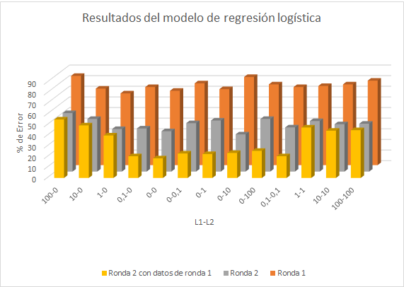

<h1>Predicción Votantes</h1>
<h2>IC-6200 Inteligencia Artificial</h2>
<h2>Integrantes</h2>
<ul>
<li>Brayan Fajardo Alvarado - 201157035</li>
<li>David Gómez Vargas - 2015028430</li>
<li>Luis Edward Rodríguez Varela - 2014082498</li>
</ul>

<h3>I Semestre 2018</h3>
<h1></h1>

---
<h2>1. Introducción</h2>
<h2>2. Simulador de Votantes</h2>

Para realizar los modelos de predicción de votantes es necesario un generador de datos sobre las votaciones. En este mismo curso, en el primer proyecto corto se realizó un simulador de votantes con datos de la primera ronda, además, de datos sociales recopilados en el censo del 2011.

El diseño de este simulador de votantes se divide en 3 partes:

<ul>
 <li> Generación de la población: Se hace una carga de un archivo csv, el cual contiene la información de los votos obtenidos por partido por cantón, y a partir de este se generan los datos de toda la población del país. A este archivo se le agregaron todos los indicadores provenientes del censo realizado en Costa Rica en el 2011.</li>
 <li>Generación de la muestra país: A partir de la creación de la población, se realiza una selección de una determinada muestra indicada por el usuario, con una cantidad no mayor a 2 millones de personas. Para la selección de esta muestra se hace uso de un algoritmo de generación aleatoria, la cual toma en cuenta la proporción de personas que se pueden representar a nivel nacional, y con esto se permite obtener muestras más cercanas a la realidad.
Para la generación de la muestra país, se hace uso de la función: <strong>generar_muestra_pais(n)</strong>.</li>
<li>Generación de la muestra provincia: Para la generación de la muestra de una provincia, se realiza lo mismo realizado en la generación de la muestra de un país, con la única diferencia de que los datos son filtrados por la provincia dada por argumento desde la entrada de una función. Para la generación de una muestra de provincia, se utiliza la función <strong>generar_muestra_provincia(n, nombre_provincia)</strong>.</li>
</ul>

La salida de las funciones es una lista conteniendo las listas con los siguientes atributos:

<ul>
<li>Provincia donde voto.</li>
<li>Cantón donde voto.</li>
<li>Poblacion del canton.</li>
<li>Superficie del cantón.</li>
<li>Densidad del cantón.</li>
<li>Tipo de localidad (Urbano,
Rural).</li>
<li>Sexo.</li>
<li>Edad.</li>
<li>Viviendas individuales
ocupadas.</li>
<li>Promedio de ocupantes por
vivienda.</li>
<li>Estado de la vivienda
(Bueno, Malo).</li>
<li>Viviendas de vivienda con
respecto a los habitantes (Hacinamiento).</li>
<li>Alfabetismo.</li>
<li>Escolaridad promedio.</li>
<li>Asistencia a la educacion
regular.</li>
<li>Tasa de participacion (En
fuerza de trabajo).</li>
<li>Seguro laboral (Trabaja con
o sin seguro).</li>
<li>Persona nacional o
extranjera.</li>
<li>Persona discapacitada.</li>
<li>Persona asegurada.</li>
<li>Hogar con jefatura femenina.</li>
<li>Hogar con jefatura
compartida.</li>
<li>Partido por el cual el individuo voto en primera ronda.</li>
<li>Partido por el cual el individuo voto en segunda ronda.</li>
</ul>
<h2>3. Modelo Lineal</h2>

El modelo de regresión logística utiliza la biblioteca Tensorflow de inteligencia artificial para clasificar los datos, se crea una función lineal:

<blockquote>

<strong>y</strong> = m <strong>x</strong> + b

</blockquote>

Con esta función y los datos de entrenamiento se pueden encontrar los valores de "m" y "b" óptimos para predecir valores de salida.

<h3>Diseño del modelo</h3>

Para este modelo fue necesario convertir todos los datos de entrada a datos númericos, además, es necesario separar las entradas de las salidas de los datos de ejemplo para entrenar el modelo. Se utiliza oneHotEncoder de la biblioteca Scikit para convertir todos los datos a binario y así poder introducir los datos para entrenamiento

Esta biblioteca utiliza tensores, por lo que es necesario crear los marcadores iniciales "x" y "y", las variables "m" y "b" y la función lineal anterior, luego con descenso de gradiente y valores de regularización L1 y L2 se optimiza el modelo conforme es entrenado con los datos de entrenamiento. Los valores de regularización son usados para evitar el sobreajuste y eliminar el ruido en el modelo

<h3>Prueba del modelo</h3>

Para probar el modelo solo se necesita llamar la función eval(), brindando como paramétro el dato a probar y la sesión donde se optimizó la función con los tensores.

<h4>Análisis de resultados con diferentes valores de L1 y L2.</h4>

<h2>4. Red Neuronal</h2>
<h2>5. Árbol de decisión</h2>
<h2>6. KNN</h2>

El modelo no paramétrico de busqueda de los k vecinos más cercanos es un algoritmo perezoso porque durante el entrenamiento solo guarda datos, no construye ningún modelo específico, por lo que la clasificación se realiza cuando se realizan las pruebas. La forma de guardar los datos es con un árbol de k-dimensiones, con esto se evita hacer un cálculo de distancia a todos los elementos de manera lineal.

Los problemas que afectan a este modelo son:

<ul>
<li>Los atributos irrelevantes lo afectan.</li>
<li>Muy sensible al ruido.</li>
<li>Lento si hay muchos datos de entrenamiento.</li>
</ul>
<h3>Diseño del modelo</h3>
El modelo utiliza un árbol binario donde se guardan cada uno de los individuos de entrenamiento comparando en cada nivel de profundidad el atributo con índice:
<blockquote>

<strong>Índice</strong> = <strong>Profundidad</strong> mod <strong>Cantidad de atributos</strong>

</blockquote>

Entonces, por ejemplo: en el primer nodo la profundidad es 0 y la cantidad de atributos de entrada son 22 por lo que al aplicar la fórmula el índice a comparar es el 0, así si en la comparación es menor el dato nuevo se escribe en el hijo izquierdo, y si en la comparación el dato nuevo es mayor entonces se escribe en el hijo derecho, de esta manera recursivamente se llena todo el árbol de k-dimensiones.

<blockquote>

<strong>Índice</strong> = 0 mod 22 = 0

</blockquote>
<h3>Prueba del modelo</h3>

Para probar el modelo se realiza un proceso similar al del llenado del árbol, se compara, utilizando la fórmula de la obtención del índice, cada atributo para buscar la ruta del árbol a seguir, comparando la distancia por cada nodo que pasa y guardandolos en una lista de vecinos cercanos.

Cuando el individuo ya ha recorrido todo el árbol se ordenan los vecinos cercanos de menor a mayor con respecto a la distancia con el individuo de prueba y se seleccionan los primeros k individuos, luego se cuentan la cantidad de coincidencias y se retorna el partido político con mayor coincidencia.

<blockquote>

<strong>Distancia</strong> = Sumatoria(

| atributo1 - atributo2 | si son <strong>Continuos</strong>.

0 si son <strong>Discretos</strong> y son iguales.

1 si son <strong>Discretos</strong> y son diferentes.)

</blockquote>
<h4>Análisis de resultados con diferentes valores de k.</h4>

<h2>7. SVM</h2>

El modelo de Support Vector Machines fue realizado con la biblioteca Scikit-Learn de inteligencia artificial, este modelo es complejo pues los datos a clasificar no son linealmente separables y se necesita encontrar un conjunto de vectores que formen una función que pueda clasificar los datos.

<h3>Diseño del modelo</h3>

Para este modelo fue necesario convertir todos los datos de entrada a datos númericos, además, es necesario separar las entradas de las salidas de los datos de ejemplo para entrenar el modelo

Cuando se inicializa el objeto "svm" de la biblioteca se dan como parámetros los datos de entrenamiento, el kernel (linear, rbf, poly, sigmoid), la penalización de error (C) y gamma en caso de que se utilice como kernel "rbf" o "sigmoid". Cuando se llama al método fit() la biblioteca busca los vectores con mejor ajuste y crea el modelo listo para ser probado.

<h3>Prueba del modelo</h3>

Para probar el modelo solo es necesario llamar al método predict() de la biblioteca con un dato como parámetro y se retorna un partido político como salida. Con diferentes paramétros de entrenamiento se obtienen diferentes resultados en la salida, se analizarán a continuación.

<h4>Análisis de resultados con diferentes valores de kernel, C y gamma.</h4>

<h2>8. Conclusiones</h2>
<h2>9. Apéndices</h2>
<h3>9.1. Manual de instalación</h3>
<h3>9.2. Manual de usuario</h3>

<h1 id="welcome-to-stackedit">Welcome to StackEdit!</h1>

Hi! I’m your first Markdown file in <strong>StackEdit</strong>. If you want to learn about StackEdit, you can read me. If you want to play with Markdown, you can edit me. If you have finished with me, you can just create new files by opening the <strong>file explorer</strong> on the left corner of the navigation bar.

<h1 id="files">Files</h1>

StackEdit stores your files in your browser, which means all your files are automatically saved locally and are accessible <strong>offline!</strong>

<h2 id="create-files-and-folders">Create files and folders</h2>

The file explorer is accessible using the button in left corner of the navigation bar. You can create a new file by clicking the <strong>New file</strong> button in the file explorer. You can also create folders by clicking the <strong>New folder</strong> button.

<h2 id="switch-to-another-file">Switch to another file</h2>

All your files are listed in the file explorer. You can switch from one to another by clicking a file in the list.

<h2 id="rename-a-file">Rename a file</h2>

You can rename the current file by clicking the file name in the navigation bar or by clicking the <strong>Rename</strong> button in the file explorer.

<h2 id="delete-a-file">Delete a file</h2>

You can delete the current file by clicking the <strong>Remove</strong> button in the file explorer. The file will be moved into the <strong>Trash</strong> folder and automatically deleted after 7 days of inactivity.

<h2 id="export-a-file">Export a file</h2>

You can export the current file by clicking <strong>Export to disk</strong> in the menu. You can choose to export the file as plain Markdown, as HTML using a Handlebars template or as a PDF.

<h1 id="synchronization">Synchronization</h1>

Synchronization is one of the biggest features of StackEdit. It enables you to synchronize any file in your workspace with other files stored in your <strong>Google Drive</strong>, your <strong>Dropbox</strong> and your <strong>GitHub</strong> accounts. This allows you to keep writing on other devices, collaborate with people you share the file with, integrate easily into your workflow… The synchronization mechanism takes place every minute in the background, downloading, merging, and uploading file modifications.

There are two types of synchronization and they can complement each other:

<ul>
<li>

The workspace synchronization will sync all your files, folders and settings automatically. This will allow you to fetch your workspace on any other device.

<blockquote>

To start syncing your workspace, just sign in with Google in the menu.

</blockquote>
</li>
<li>

The file synchronization will keep one file of the workspace synced with one or multiple files in <strong>Google Drive</strong>, <strong>Dropbox</strong> or <strong>GitHub</strong>.

<blockquote>

Before starting to sync files, you must link an account in the <strong>Synchronize</strong> sub-menu.

</blockquote>
</li>
</ul>
<h2 id="open-a-file">Open a file</h2>

You can open a file from <strong>Google Drive</strong>, <strong>Dropbox</strong> or <strong>GitHub</strong> by opening the <strong>Synchronize</strong> sub-menu and clicking <strong>Open from</strong>. Once opened in the workspace, any modification in the file will be automatically synced.

<h2 id="save-a-file">Save a file</h2>

You can save any file of the workspace to <strong>Google Drive</strong>, <strong>Dropbox</strong> or <strong>GitHub</strong> by opening the <strong>Synchronize</strong> sub-menu and clicking <strong>Save on</strong>. Even if a file in the workspace is already synced, you can save it to another location. StackEdit can sync one file with multiple locations and accounts.

<h2 id="synchronize-a-file">Synchronize a file</h2>

Once your file is linked to a synchronized location, StackEdit will periodically synchronize it by downloading/uploading any modification. A merge will be performed if necessary and conflicts will be resolved.

If you just have modified your file and you want to force syncing, click the <strong>Synchronize now</strong> button in the navigation bar.

<blockquote>

<strong>Note:</strong> The <strong>Synchronize now</strong> button is disabled if you have no file to synchronize.

</blockquote>
<h2 id="manage-file-synchronization">Manage file synchronization</h2>

Since one file can be synced with multiple locations, you can list and manage synchronized locations by clicking <strong>File synchronization</strong> in the <strong>Synchronize</strong> sub-menu. This allows you to list and remove synchronized locations that are linked to your file.

<h1 id="publication">Publication</h1>

Publishing in StackEdit makes it simple for you to publish online your files. Once you’re happy with a file, you can publish it to different hosting platforms like <strong>Blogger</strong>, <strong>Dropbox</strong>, <strong>Gist</strong>, <strong>GitHub</strong>, <strong>Google Drive</strong>, <strong>WordPress</strong> and <strong>Zendesk</strong>. With <a href="http://handlebarsjs.com/">Handlebars templates</a>, you have full control over what you export.

<blockquote>

Before starting to publish, you must link an account in the <strong>Publish</strong> sub-menu.

</blockquote>
<h2 id="publish-a-file">Publish a File</h2>

You can publish your file by opening the <strong>Publish</strong> sub-menu and by clicking <strong>Publish to</strong>. For some locations, you can choose between the following formats:

<ul>
<li>Markdown: publish the Markdown text on a website that can interpret it (<strong>GitHub</strong> for instance),</li>
<li>HTML: publish the file converted to HTML via a Handlebars template (on a blog for example).</li>
</ul>
<h2 id="update-a-publication">Update a publication</h2>

After publishing, StackEdit keeps your file linked to that publication which makes it easy for you to re-publish it. Once you have modified your file and you want to update your publication, click on the <strong>Publish now</strong> button in the navigation bar.

<blockquote>

<strong>Note:</strong> The <strong>Publish now</strong> button is disabled if your file has not been published yet.

</blockquote>
<h2 id="manage-file-publication">Manage file publication</h2>

Since one file can be published to multiple locations, you can list and manage publish locations by clicking <strong>File publication</strong> in the <strong>Publish</strong> sub-menu. This allows you to list and remove publication locations that are linked to your file.

<h1 id="markdown-extensions">Markdown extensions</h1>

StackEdit extends the standard Markdown syntax by adding extra <strong>Markdown extensions</strong>, providing you with some nice features.

<blockquote>

<strong>ProTip:</strong> You can disable any <strong>Markdown extension</strong> in the <strong>File properties</strong> dialog.

</blockquote>
<h2 id="smartypants">SmartyPants</h2>

SmartyPants converts ASCII punctuation characters into “smart” typographic punctuation HTML entities. For example:

<table>
<thead>
<tr>
<th></th>
<th>ASCII</th>
<th>HTML</th>
</tr>
</thead>
<tbody>
<tr>
<td>Single backticks</td>
<td><code>'Isn't this fun?'</code></td>
<td>‘Isn’t this fun?’</td>
</tr>
<tr>
<td>Quotes</td>
<td><code>"Isn't this fun?"</code></td>
<td>“Isn’t this fun?”</td>
</tr>
<tr>
<td>Dashes</td>
<td><code>-- is en-dash, --- is em-dash</code></td>
<td>– is en-dash, — is em-dash</td>
</tr>
</tbody>
</table><h2 id="katex">KaTeX</h2>

You can render LaTeX mathematical expressions using <a href="https://khan.github.io/KaTeX/">KaTeX</a>:

The <em>Gamma function</em> satisfying <math><semantics><mrow><mi mathvariant="normal">Γ</mi><mo>(</mo><mi>n</mi><mo>)</mo><mo>=</mo><mo>(</mo><mi>n</mi><mo>−</mo><mn>1</mn><mo>)</mo><mo>!</mo><mspace width="1em"></mspace><mi mathvariant="normal">∀</mi><mi>n</mi><mo>∈</mo><mi mathvariant="double-struck">N</mi></mrow><annotation encoding="application/x-tex">\Gamma(n) = (n-1)!\quad\forall n\in\mathbb N</annotation></semantics></math>Γ(n)=(n−1)!∀n∈N is via the Euler integral

<math><semantics><mrow><mi mathvariant="normal">Γ</mi><mo>(</mo><mi>z</mi><mo>)</mo><mo>=</mo><msubsup><mo>∫</mo><mn>0</mn><mi mathvariant="normal">∞</mi></msubsup><msup><mi>t</mi><mrow><mi>z</mi><mo>−</mo><mn>1</mn></mrow></msup><msup><mi>e</mi><mrow><mo>−</mo><mi>t</mi></mrow></msup><mi>d</mi><mi>t</mi><mspace width="0.16667em"></mspace><mi mathvariant="normal">.</mi></mrow><annotation encoding="application/x-tex">
\Gamma(z) = \int_0^\infty t^{z-1}e^{-t}dt\,.
</annotation></semantics></math>Γ(z)=∫0∞​tz−1e−tdt.

<blockquote>

You can find more information about <strong>LaTeX</strong> mathematical expressions <a href="http://meta.math.stackexchange.com/questions/5020/mathjax-basic-tutorial-and-quick-reference">here</a>.

</blockquote>
<h2 id="uml-diagrams">UML diagrams</h2>

You can render UML diagrams using <a href="https://mermaidjs.github.io/">Mermaid</a>. For example, this will produce a sequence diagram:

<svg xmlns="http://www.w3.org/2000/svg" id="mermaid-svg-0jjpphqqJ6d0ONb9" height="100%" width="100%" style="max-width:750px;" viewBox="-50 -10 750 484"><g></g><g><line id="actor6" x1="75" y1="5" x2="75" y2="473" class="actor-line" stroke-width="0.5px" stroke="#999"></line><rect x="0" y="0" fill="#eaeaea" stroke="#666" width="150" height="65" rx="3" ry="3" class="actor"></rect><text x="75" y="32.5" dominant-baseline="central" alignment-baseline="central" class="actor" style="text-anchor: middle;"><tspan x="75" dy="0">Alice</tspan></text></g><g><line id="actor7" x1="275" y1="5" x2="275" y2="473" class="actor-line" stroke-width="0.5px" stroke="#999"></line><rect x="200" y="0" fill="#eaeaea" stroke="#666" width="150" height="65" rx="3" ry="3" class="actor"></rect><text x="275" y="32.5" dominant-baseline="central" alignment-baseline="central" class="actor" style="text-anchor: middle;"><tspan x="275" dy="0">Bob</tspan></text></g><g><line id="actor8" x1="475" y1="5" x2="475" y2="473" class="actor-line" stroke-width="0.5px" stroke="#999"></line><rect x="400" y="0" fill="#eaeaea" stroke="#666" width="150" height="65" rx="3" ry="3" class="actor"></rect><text x="475" y="32.5" dominant-baseline="central" alignment-baseline="central" class="actor" style="text-anchor: middle;"><tspan x="475" dy="0">John</tspan></text></g><defs><marker id="arrowhead" refX="5" refY="2" markerWidth="6" markerHeight="4" orient="auto"><path d="M 0,0 V 4 L6,2 Z"></path></marker></defs><defs><marker id="crosshead" markerWidth="15" markerHeight="8" orient="auto" refX="16" refY="4"><path fill="black" stroke="#000000" stroke-width="1px" d="M 9,2 V 6 L16,4 Z" style="stroke-dasharray: 0, 0;"></path><path fill="none" stroke="#000000" stroke-width="1px" d="M 0,1 L 6,7 M 6,1 L 0,7" style="stroke-dasharray: 0, 0;"></path></marker></defs><g><text x="175" y="93" class="messageText" style="text-anchor: middle;">Hello Bob, how are you?</text><line x1="75" y1="100" x2="275" y2="100" class="messageLine0" stroke-width="2" stroke="black" marker-end="url(#arrowhead)" style="fill: none;"></line></g><g><text x="375" y="128" class="messageText" style="text-anchor: middle;">How about you John?</text><line x1="275" y1="135" x2="475" y2="135" class="messageLine1" stroke-width="2" stroke="black" marker-end="url(#arrowhead)" style="stroke-dasharray: 3, 3; fill: none;"></line></g><g><text x="175" y="163" class="messageText" style="text-anchor: middle;">I am good thanks!</text><line x1="275" y1="170" x2="75" y2="170" class="messageLine1" stroke-width="2" stroke="black" marker-end="url(#crosshead)" style="stroke-dasharray: 3, 3; fill: none;"></line></g><g><text x="375" y="198" class="messageText" style="text-anchor: middle;">I am good thanks!</text><line x1="275" y1="205" x2="475" y2="205" class="messageLine0" stroke-width="2" stroke="black" marker-end="url(#crosshead)" style="fill: none;"></line></g><g><rect x="500" y="215" fill="#EDF2AE" stroke="#666" width="150" height="103" rx="0" ry="0" class="note"></rect><text x="516" y="245" fill="black" class="noteText"><tspan x="516">Bob thinks a long</tspan><tspan dy="23" x="516">long time, so long</tspan><tspan dy="23" x="516">that the text does</tspan><tspan dy="23" x="516">not fit on a row.</tspan></text></g><g><text x="175" y="346" class="messageText" style="text-anchor: middle;">Checking with John...</text><line x1="275" y1="353" x2="75" y2="353" class="messageLine1" stroke-width="2" stroke="black" style="stroke-dasharray: 3, 3; fill: none;"></line></g><g><text x="275" y="381" class="messageText" style="text-anchor: middle;">Yes... John, how are you?</text><line x1="75" y1="388" x2="475" y2="388" class="messageLine0" stroke-width="2" stroke="black" style="fill: none;"></line></g><g><rect x="0" y="408" fill="#eaeaea" stroke="#666" width="150" height="65" rx="3" ry="3" class="actor"></rect><text x="75" y="440.5" dominant-baseline="central" alignment-baseline="central" class="actor" style="text-anchor: middle;"><tspan x="75" dy="0">Alice</tspan></text></g><g><rect x="200" y="408" fill="#eaeaea" stroke="#666" width="150" height="65" rx="3" ry="3" class="actor"></rect><text x="275" y="440.5" dominant-baseline="central" alignment-baseline="central" class="actor" style="text-anchor: middle;"><tspan x="275" dy="0">Bob</tspan></text></g><g><rect x="400" y="408" fill="#eaeaea" stroke="#666" width="150" height="65" rx="3" ry="3" class="actor"></rect><text x="475" y="440.5" dominant-baseline="central" alignment-baseline="central" class="actor" style="text-anchor: middle;"><tspan x="475" dy="0">John</tspan></text></g></svg>

And this will produce a flow chart:

<svg xmlns="http://www.w3.org/2000/svg" id="mermaid-svg-IkweW5j8IZOjJvZE" height="100%" viewBox="0 0 531.1218719482422 215.890625" style="max-width:531.1218719482422px;"><g><g class="output"><g class="clusters"></g><g class="edgePaths"><g class="edgePath" style="opacity: 1;"><path class="path" d="M119.91170576572816,78.41796875L179.3203125,49.9453125L255.2578125,49.9453125" marker-end="url(#arrowhead51)" style="fill:none"></path><defs><marker id="arrowhead51" viewBox="0 0 10 10" refX="9" refY="5" markerUnits="strokeWidth" markerWidth="8" markerHeight="6" orient="auto"><path d="M 0 0 L 10 5 L 0 10 z" class="arrowheadPath" style="stroke-width: 1; stroke-dasharray: 1, 0;"></path></marker></defs></g><g class="edgePath" style="opacity: 1;"><path class="path" d="M119.91170576572816,124.41796875L179.3203125,152.890625L234.796875,152.890625" marker-end="url(#arrowhead52)" style="fill:none"></path><defs><marker id="arrowhead52" viewBox="0 0 10 10" refX="9" refY="5" markerUnits="strokeWidth" markerWidth="8" markerHeight="6" orient="auto"><path d="M 0 0 L 10 5 L 0 10 z" class="arrowheadPath" style="stroke-width: 1; stroke-dasharray: 1, 0;"></path></marker></defs></g><g class="edgePath" style="opacity: 1;"><path class="path" d="M315.1484375,49.9453125L360.609375,49.9453125L407.12250953976667,80.90483573611228" marker-end="url(#arrowhead53)" style="fill:none"></path><defs><marker id="arrowhead53" viewBox="0 0 10 10" refX="9" refY="5" markerUnits="strokeWidth" markerWidth="8" markerHeight="6" orient="auto"><path d="M 0 0 L 10 5 L 0 10 z" class="arrowheadPath" style="stroke-width: 1; stroke-dasharray: 1, 0;"></path></marker></defs></g><g class="edgePath" style="opacity: 1;"><path class="path" d="M335.609375,152.890625L360.609375,152.890625L407.12250770354245,122.93110297942131" marker-end="url(#arrowhead54)" style="fill:none"></path><defs><marker id="arrowhead54" viewBox="0 0 10 10" refX="9" refY="5" markerUnits="strokeWidth" markerWidth="8" markerHeight="6" orient="auto"><path d="M 0 0 L 10 5 L 0 10 z" class="arrowheadPath" style="stroke-width: 1; stroke-dasharray: 1, 0;"></path></marker></defs></g></g><g class="edgeLabels"><g class="edgeLabel" transform="translate(179.3203125,49.9453125)" style="opacity: 1;"><g transform="translate(-30.4765625,-13)" class="label"><foreignObject width="60.953125" height="26">
Link text
</foreignObject></g></g><g class="edgeLabel" transform="" style="opacity: 1;"><g transform="translate(0,0)" class="label"><foreignObject width="0" height="0">

</foreignObject></g></g><g class="edgeLabel" transform="" style="opacity: 1;"><g transform="translate(0,0)" class="label"><foreignObject width="0" height="0">

</foreignObject></g></g><g class="edgeLabel" transform="" style="opacity: 1;"><g transform="translate(0,0)" class="label"><foreignObject width="0" height="0">

</foreignObject></g></g></g><g class="nodes"><g class="node" id="A" transform="translate(71.921875,101.41796875)" style="opacity: 1;"><rect rx="0" ry="0" x="-51.921875" y="-23" width="103.84375" height="46"></rect><g class="label" transform="translate(0,0)"><g transform="translate(-41.921875,-13)"><foreignObject width="83.84375" height="26">
Square Rect
</foreignObject></g></g></g><g class="node" id="B" transform="translate(285.203125,49.9453125)" style="opacity: 1;"><circle x="-29.9453125" y="-23" r="29.9453125"></circle><g class="label" transform="translate(0,0)"><g transform="translate(-19.9453125,-13)"><foreignObject width="39.890625" height="26">
Circle
</foreignObject></g></g></g><g class="node" id="C" transform="translate(285.203125,152.890625)" style="opacity: 1;"><rect rx="5" ry="5" x="-50.40625" y="-23" width="100.8125" height="46"></rect><g class="label" transform="translate(0,0)"><g transform="translate(-40.40625,-13)"><foreignObject width="80.8125" height="26">
Round Rect
</foreignObject></g></g></g><g class="node" id="D" transform="translate(438.3656234741211,101.41796875)" style="opacity: 1;"><polygon points="52.75625,0 105.5125,-52.75625 52.75625,-105.5125 0,-52.75625" rx="5" ry="5" transform="translate(-52.75625,52.75625)"></polygon><g class="label" transform="translate(0,0)"><g transform="translate(-32.9453125,-13)"><foreignObject width="65.890625" height="26">
Rhombus
</foreignObject></g></g></g></g></g></g></svg>

